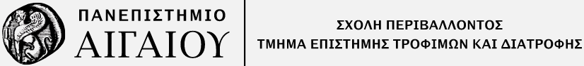

# ΜΑΘΗΜΑΤΙΚΑ - Εργαστήριο

Διδάσκων: Στάθης Καλούδης

Χειμερινό εξ. 2024-2025

**Περιεχόμενα**

1. [Συναρτήσεις](./chapter_1.md)

2. [Όριο Συνάρτησης](./chapter_2.md)

3. [Παράγωγος Συνάρτησης](./chapter_3.md)

4. [Ολοκληρώματα](./chapter_4.md)

5. [Διανύσματα](./chapter_5.md)

6. [Πίνακες](./chapter_6.md)

7. [Πίνακες - Ορίζουσες](./chapter_7.md)

8. [Γραμμικά συστήματα](./chapter_8.md)

    
    
